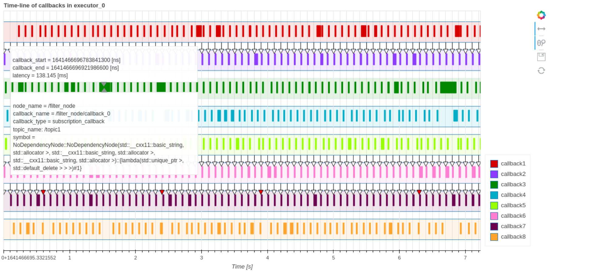

# ギャラリー

CARET で可視化できる図の例を上げます。

jupyter 上での可視化を想定してします。  
notebook 上で bokeh のグラフも表示させるため、以下コマンドを事前に実行しておく必要があります。

```python
from bokeh.plotting import output_notebook, figure, show
output_notebook()
```

## メッセージフロー

各メッセージがどの時点で何の処理をしていたか可視化できます。

```python
from caret_analyze.plot import message_flow

path = app.get_path('target_path')

message_flow(path, granularity='node', treat_drop_as_delay=False, lstrip_s=1, rstrip_s=1)
```


縦軸は上から下に向かって、パスの始めから終わりに対応しています。
各線はメッセージの流れを示しています。グレーの矩形領域はコールバックの実行時間を示しています。

treat_drop_as_delay=False とすると、ノード内コールバック間で最新のメッセージのみを使うという仮定し、線を途中で途切れさせて表示します。
treat_drop_as_delay=True とすると、メッセージロストを遅延として換算します。

メッセージフロー図では、bokeh の基本操作に加え、以下の操作が可能です。

- 片方の軸のスケール調整
  - 軸のラベル上でホイール操作することで、X 軸のみまたは Y 軸のみのスケール調整が可能です。
- 詳細情報の表示
  - メッセージフローの線や、グレーの矩形領域にカーソルを合わせると、詳細情報が確認できます。

## チェーンのレイテンシ

```python
from caret_analyze.plot import chain_latency

path = app.get_path('target_path')

chain_latency(path, granularity='node', treat_drop_as_delay=False, lstrip_s=1, rstrip_s=1)
```

`treat_drop_as_delay=False`とした場合、ロストせず終点まで到達したメッセージのレイテンシを出力します。
`treat_drop_as_delay=True`とした場合、ロスト箇所を遅延として算出したメッセージのレイテンシを出力します。


## レイテンシの時系列波形

```python
t, latency_ns = path.to_timeseries(remove_dropped=False, treat_drop_as_delay=True)
latency_ms = latency_ns * 1.0e-6

p = figure()
p.line(t, latency_ms)
show(p)
```


## レイテンシのヒストグラム

ヒストグラムも以下のようにして可視化できます。

```python
bins, hist = path.to_histogram(treat_drop_as_delay=True)
p = figure()
p.step(hist[1:], bins)
show(p)
```


## API to get information about each callback

CARET can visualize execution frequency, jitter and latency along time for each callback and provide them in the pandas DataFrame format.
Several sets of sample program and output are shown in subsequent sections.
In each example, the following commands are executed in advance.

```python
from caret_analyze import Architecture, Application, Lttng
from caret_analyze.plot import Plot

arch = Architecture('lttng', './e2e_sample')
lttng = Lttng('./e2e_sample')
app = Application(arch, lttng)
```

Please see [CARET analyze API document](https://tier4.github.io/CARET_analyze/latest/plot/) for details on the arguments of this API.

### Execution frequency

```python
# get dataframe
plot = Plot.create_callback_frequency_plot(app)

frequency_df = plot.to_dataframe()
frequency_df

# ---Output in jupyter-notebook as below---
```


```python
# show time-line
plot = Plot.create_callback_frequency_plot(app)

plot.show()

# ---Output in jupyter-notebook as below---
```


### Jitter

```python
# get dataframe
plot = Plot.create_callback_jitter_plot(app)

jitter_df = plot.to_dataframe()
jitter_df

# ---Output in jupyter-notebook as below---
```


```python
# show time-line
plot = Plot.create_callback_jitter_plot(app)

plot.show()

# ---Output in jupyter-notebook as below---
```


### Latency

```python
# get dataframe
plot = Plot.create_callback_latency_plot(app)

latency_df = plot.to_dataframe()
latency_df

# ---Output in jupyter-notebook as below---
```


```python
# show time-line
plot = Plot.create_callback_latency_plot(app)

plot.show()

# ---Output in jupyter-notebook as below---
```


## Callback Scheduling Visualization

Callback Scheduling Visualization will show you callback scheduling of targets such as a Node, Executor, and Callbackgroup.

```python
from caret_analyze import Architecture, Application, Lttng
from caret_analyze.plot import callback_sched
arch = Architecture('lttng', './e2e_sample')
lttng = Lttng('./e2e_sample')
app = Application(arch, lttng)
# target: node
node = app.get_node('node_name') # get node object
callback_sched(node)
# target: executor
executor = app.get_executor('executor_name') # get executor object
callback_sched(executor)
# target: executor
cbg = app.get_callback_group('cbg_name') # get callback group object
callback_sched(cbg)
```



- Callback Scheduling Visualization
  - Short rectangles indicate the callback execution time
  - When the mouse cursor hovers over the long rectangular, a tooltip containing information about the callback will be displayed
- Timer Event Visualization
  - Arrows shows expected timing of invocation of timer callback
  - When invocations of timer callback are delayed for expected, arrows turns red; otherwise, arrows are white
  - If invocations are late for more 5 ms after expected, they are regarded as delayed
